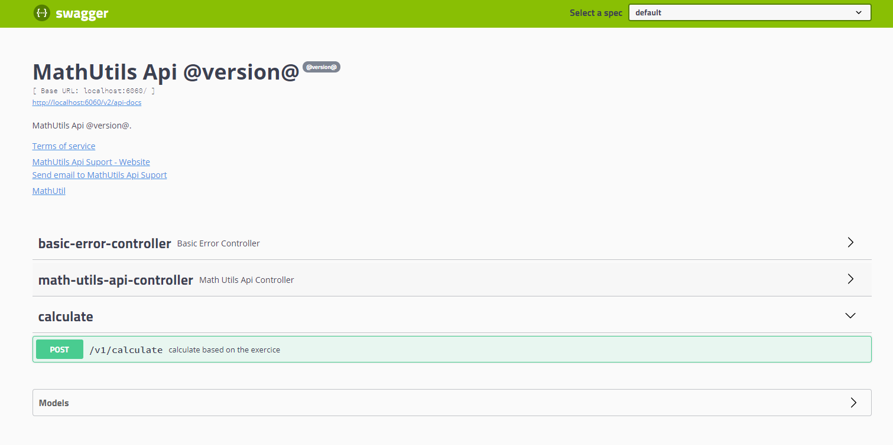

# MathUtilApi

 A REST/JSON web API in Java 8+ that accepts an array of numeric inputs and performs the following:

1) Finds the highest 3 numbers

2) Computes the square root of the sum of squares of the 3 highest numeric inputs. The following is an example input:


Run Application

1) clone or download the project

2) open project eclipse IDE 

3) convert to maven project 

4) run MathUtilsApiApplication.java 

#### End point
http://localhost:8080/v1/calculate

#### swagger-ui

http://localhost:8080/swagger-ui.html




### Test cases

### Pass test cases
  
```
curl -X POST \
  http://localhost:8080/v1/calculate \
  -H 'cache-control: no-cache' \
  -H 'content-type: application/json' \
  -d '{
	"data": [5,4,6,1]
}
'
```

```
curl -X POST \
  http://localhost:8080/v1/calculate \
  -H 'cache-control: no-cache' \
  -H 'content-type: application/json' \
  -d '{
	"data": [5,4,6,1,8]
}
'
```


### Failure Test cases

```
curl -X POST \
  http://localhost:8080/v1/calculate \
  -H 'cache-control: no-cache' \
  -H 'content-type: application/json' \
  -d '{

}
'
```

```
curl -X POST \
  http://localhost:8080/v1/calculate \
  -H 'cache-control: no-cache' \
  -H 'content-type: application/json' \
  -d '{
	"data": []
}'
```

```
curl -X POST \
  http://localhost:8080/v1/calculate \
  -H 'cache-control: no-cache' \
  -H 'content-type: application/json' \
  -d '{
	"data": [1,2]
}'
```

